# 真实世界应用案例

概率图形模型有许多不同的实际应用。 本章我们总结了概率图形模型诸多实际应用的一些示例。

- 图像处理
  - [生成](#image-generation)
  - [修复](#image-inpainting)
  - [降噪](#image-denoising)
- 语言处理
  - [生成](#text-generation)
  - [翻译](#text-translation)
- 音频处理
  - [超分辨率](#audio-superresolution)
  - [语音合成](#speech-synthesis)
  - [语音识别](#speech-recognition)
- 科学研究
  - [纠错码](#error-correcting-codes)
  - [计算生物学](#comp-bio)
  - [生态学](#ecology)
  - [经济学](#economics)
- 医疗健康
  - [诊断](#diagnosis)

## 图像钟的概率模型

考虑图像上的一个分布 $p(\bfx)$，其中 $\bfx$ 是以像素向量表示的图像，它将高概率赋予看起来真实的图像，而将低概率分配给不真实的。
有了这样一个模型，我们可以完成大量有趣的任务。

### 图像生成

[Radfold](https://arxiv.org/abs/1511.06434) 等人训练了一个概率模型 $p(\bfx)$ 将高概率赋予看起来像卧室的图片。
为了实现这一点，他们在如下图所示的卧室图像数据集上训练了他们的模型：

**训练数据集**

当我们有了卧室的概率模型，我们就可以通过从分布中采样来**生成**新的真实卧室图像。
具体来说，新的采样图像 $\hat{\mathbf{x}} \sim p(\mathbf{x})$ 是直接从我们的模型 $p(\mathbf{x})$ 中创建的，
现在可以生成类似于我们训练它使用的卧室图像的数据。

此外，生成模型之所以强大的原因之一在于，它们的参数比它们训练的数据量少得多-因此，模型必须有效地提取训练数据的本质，才能生成新样本。
我们看到，我们的卧室概率模型很好地捕捉了数据的本质，因此可以生成高度逼真的图像，其中一些示例如下：

**生成的数据**

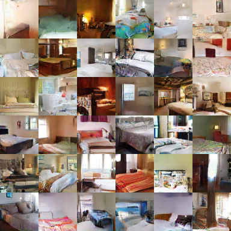

同样，我们可以学习人脸模型。

和卧室里的照片一样，这些脸部照片不是来自与真实的人，而是完全合成出来的。

同样的方法也可以用于任何其他事物。

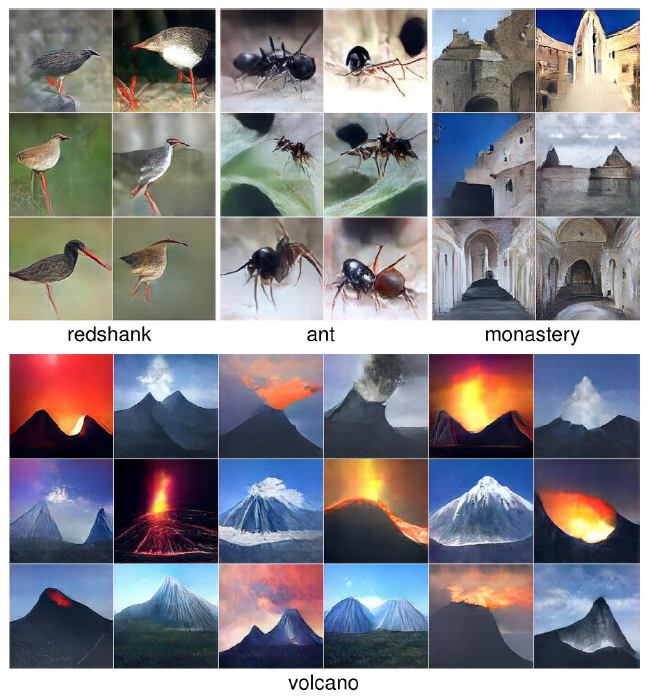

注意，图像不是完美的，可能需要细化；然而，采样生成的图像与人们期望的非常相似。

### 图像修复

用前面的脸部模型 $p(\bfx)$，我们还可以“填充”图像的其余部分。
例如，给定模型 $p(\bfx)$ 和已有图片的片段（比如照片的一部分），
我们可以从 $p(\textsf{图片} \mid \textsf{片段})$ 中采样，并生成完整图片的可能样貌：

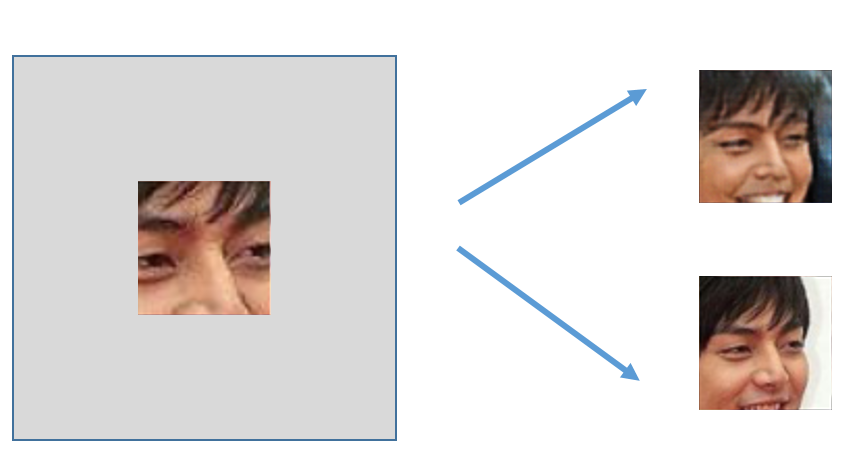

请注意概率模型捕捉不确定性的重要性：可以有多种方法来完成图像！

### 图像降噪

类似地，给定一个被噪声破坏的图像（例如，一张旧照片），我们可以尝试基于图像外观的概率模型来恢复它。
具体来说，我们需要生成一个图模型 $p(\textsf{原图} \mid \textsf{噪声图})$ ，该模型能够很好地建模后验分布。
然后，通过观察噪声图像，我们可以采样或使用精确推理来预测原始图像。

## 语言模型

了解概率分布也可以帮助我们建模自然语言语句。在这种情况下，我们希望在单词或字符序列 $x$ 上构建一个概率分布 $p(x)$，
为正确的（英语）句子分配高概率。可以从各种来源（如维基百科文章）了解此分布。

### 生成

假设我们从维基百科文章中构建了一个单词序列的分布。然后，我们可以从这个分布中采样，生成新的类似维基百科的文章，如下所示[^1] ：

> Naturalism and decision for the majority of Arab countries' capitalide was grounded
by the Irish language by [[John Clair]], [[An Imperial Japanese Revolt]], associated
with Guangzham's sovereignty. His generals were the powerful ruler of the Portugal
in the [[Protestant Immineners]], which could be said to be directly in Cantonese
Communication, which followed a ceremony and set inspired prison, training. The
emperor travelled back to [[Antioch, Perth, October 25|21]] to note, the Kingdom
of Costa Rica, unsuccessful fashioned the [[Thrales]], [[Cynth's Dajoard]], known
in western [[Scotland]], near Italy to the conquest of India with the conflict.
Copyright was the succession of independence in the slop of Syrian influence that
was a famous German movement based on a more popular servicious, non-doctrinal
and sexual power post. Many governments recognize the military housing of the
[[Civil Liberalization and Infantry Resolution 265 National Party in Hungary]],
that is sympathetic to be to the [[Punjab Resolution]]
(PJS)[http://www.humah.yahoo.com/guardian.
cfm/7754800786d17551963s89.htm Official economics Adjoint for the Nazism, Montgomery
was swear to advance to the resources for those Socialism's rule,
was starting to signing a major tripad of aid exile.]]

### 翻译

假设我们收集了一组用英文和中文转录的训练段落。我们可以建立一个概率模型$p(y \mid x)$，
根据相应的汉语句子 $x$ 生成英语句子 $y$；这是*机器翻译*的一个例子。

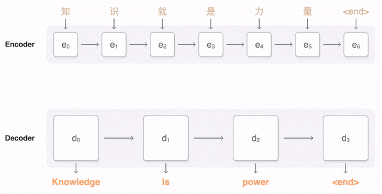

## 音频模型

我们还可以将概率图模型用于音频应用中。假设我们在音频信号上构造一个概率分布 $p(x)$，将高概率分配给听起来像人类语音的信号。

### 提升采样或超分辨率

给定低分辨率版本的音频信号，我们可以尝试提升其分辨率。
我们可以将这个问题表述为：鉴于我们的语音概率分布 $p(x)$ “知道”典型的人类语音听起来是什么样子的，
以及音频信号的一些观测值，我们的目标是计算中间时间点的信号值。

在下图中，给定观察到的音频信号（蓝色的）和音频的一些基本模型，我们旨在通过预测中间信号（白色的）来重建原始信号（虚线）的高保真版本。

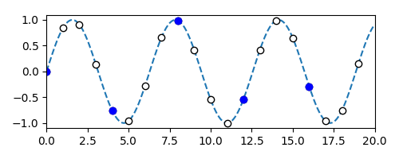

我们可以通过对 $p(\textbf{I} \mid \textbf{O})$ 进行采样或推理来解决这个问题，
其中 $\textbf{I}$ 是我们想要预测的中间信号，$\textbf{O}$ 是观察到的低分辨率音频信号。

[音频信号超分辨率demo](https://kuleshov.github.io/audio-super-res/)

### 语音合成

正如我们在图像处理中所做的那样，我们还可以对模型进行采样并生成（合成）语音信号。

[语音合成demo](https://deepmind.com/blog/wavenet-generative-model-raw-audio/)

### 语音识别

给定语音信号和语言（文本）的（联合）模型，我们可以尝试从音频信号中推断语言内容。

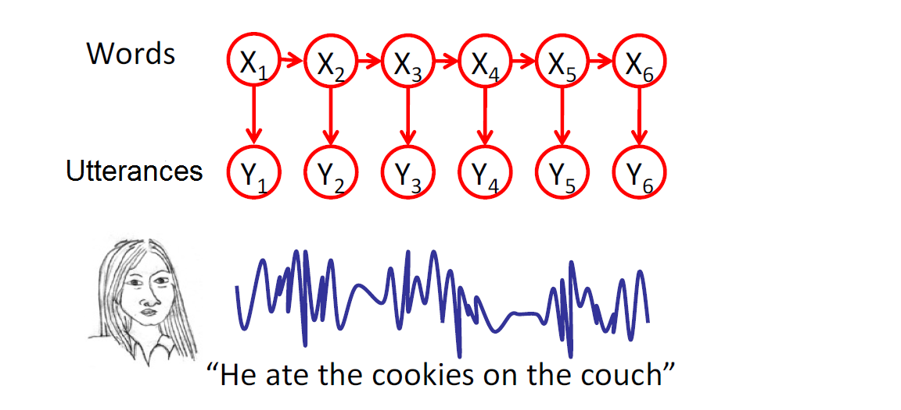

## 科学研究

### 纠错码

在非理论世界中，概率模型通常用于建模通信信道（例如，以太网或Wifi）。
例如，如果你通过信道发送消息，由于噪声，可能会在另一端收到不同的消息。
基于图模型的纠错码及技术常用于检测和纠正通信错误。

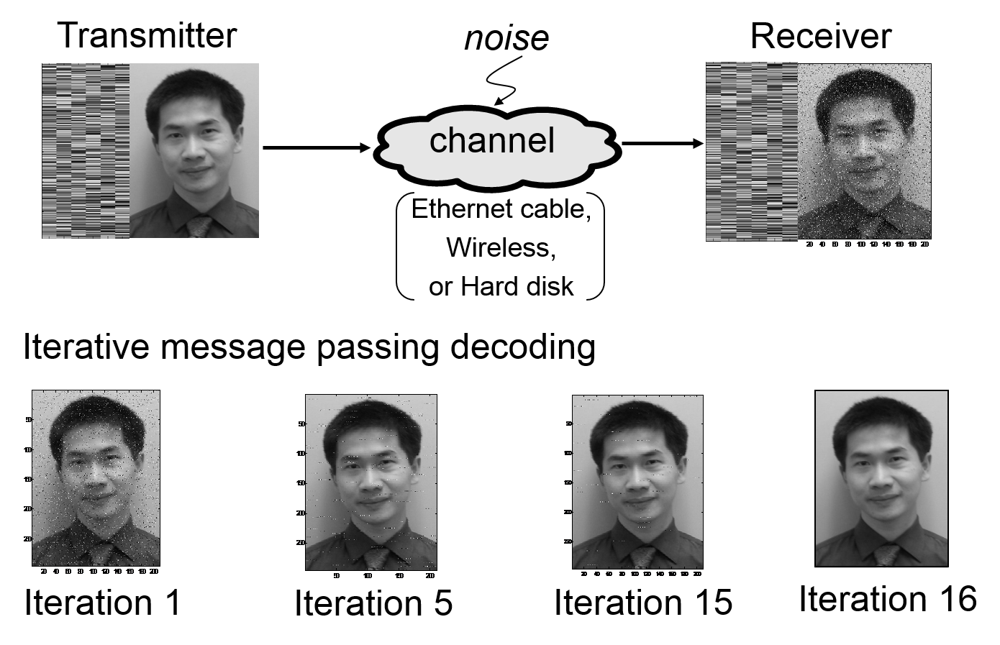

### 计算生物学

图模型也广泛应用于计算生物学。例如，给定DNA序列如何随时间演化的模型，可以从给定物种的DNA序列重建系统发育树。

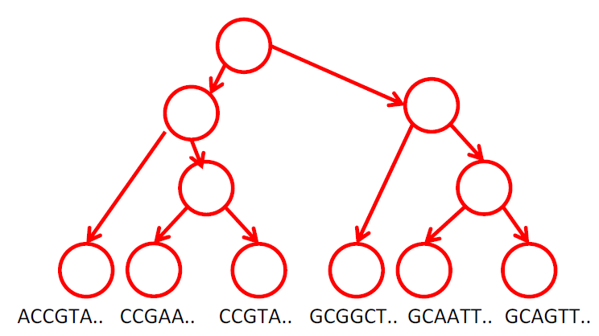

### 生态学

图模型常用于研究随空间和时间演变的现象，捕捉空间和时间相关性。例如，可以用来研究鸟类迁徙。

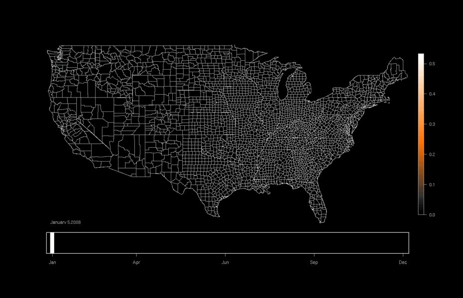

### 经济学

图模型可用于建模利息数量的空间分布（例如，基于资产或支出的财富度量）。

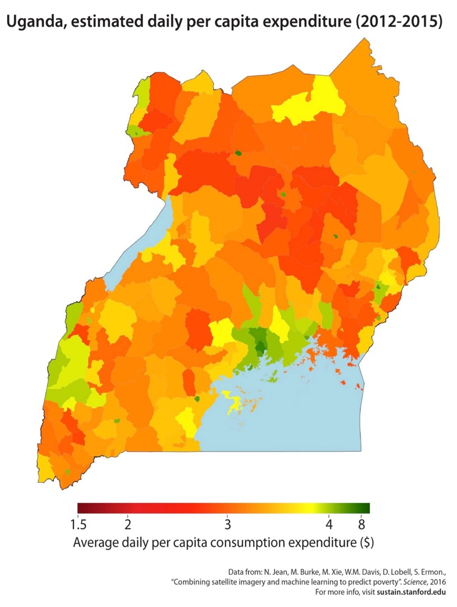

最后两个应用即所谓的时空模型。它们依赖于跨时间和空间收集的数据。

## 医疗健康

### 医疗诊断

概率图模型可以帮助医生诊断疾病和预测不良反应。例如，1998年，犹他州盐湖城的LDS医院开发了诊断肺炎的贝叶斯网络。
他们的模型能够以高灵敏度（0.95）和特异性（0.965）区分肺炎患者和其他疾病患者，并在临床上使用多年。他们的网络模型概述如下：

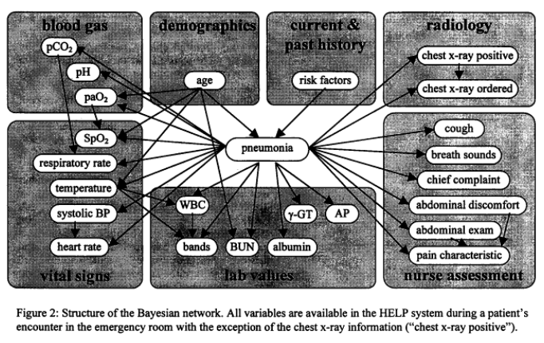

[^1]: 来自 [The Unreasonable Effectiveness of Recurrent Neural Networks](http://karpathy.github.io/2015/05/21/rnn-effectiveness/)
