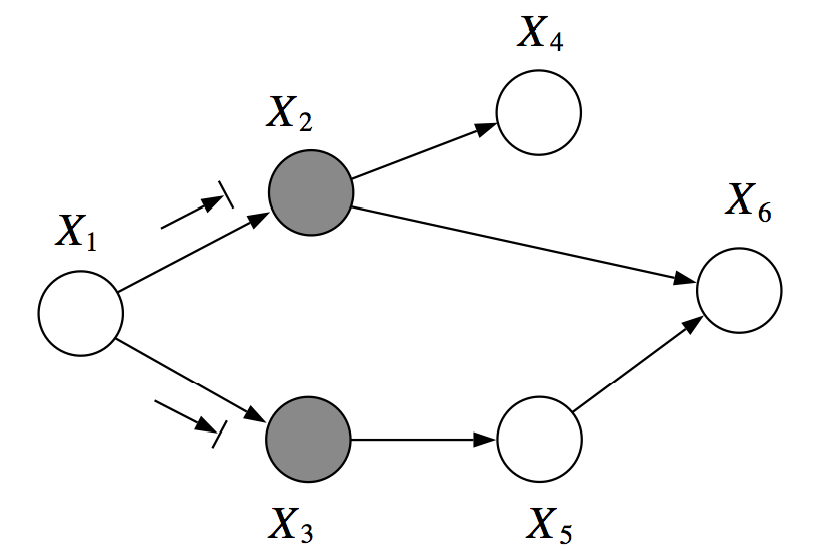
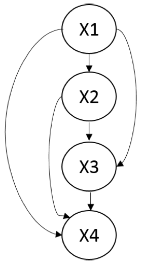

# 贝叶斯网络

我们先从*表示*这一主题开始：我们如何选择概率分布来模拟真实世界中我们感兴趣的方面？
提出一个好的模型并不容易：我们在导言中看到，一个简单的垃圾邮件分类模型需要我们指定一系列参数，这些参数随着英语单词数呈指数级增长！

本章中，我们将学习一种避免此类复杂情况的方法。我们将：

- 学习一种仅使用少量参数参数化概率分布的有效且通用的技术。
- 考察如何通过有*向无环图*（DAG）优雅地描述结果模型。
- 研究DAG的结构与其描述分布做出的建模假设之间的联系；这不仅会使这些建模假设更加明确，还将帮助我们设计更高效的推理算法。

我们这里用到的模型被称为*贝叶斯网络*。下一章我们将看到第二种方法--*马尔可夫随机场*（MRF），重要作用于*无向图*。
贝叶斯网络有效地反映了因果关系，而马尔可夫随机场不能。因此，对于随机变量之间没有明确因果关系的问题，马尔可夫随机场更适用。

## 贝叶斯网络概率模型

有向图模型（又称贝叶斯网络）是一类概率分布，它让有向图可以自然地描述紧凑参数化。

这种参数化背后的一般思想非常简单。

回想一下链式法则，我们可以将任何概率$p$写成：

$$
p(x_1, x_2, \dotsc, x_n) = p(x_1) p(x_2 \mid x_1) \cdots p(x_n \mid x_{n-1}, \dotsc, x_2, x_1)
$$

紧凑贝叶斯网络是一种分布，其右侧的每个因子仅依赖于少量祖先变量 $x_{A_i}$:

$$ p(x_i \mid x_{i-1}, \dotsc, x_1) = p(x_i \mid x_{A_i})$$

例如，在一个具有5个变量的模型中，我们可以选择用 $p(x_5 \mid x_4, x_3)$ 近似表示因子 $p(x_5 \mid x_4, x_3, x_2, x_1)$。
这个例子中，我们写做 $x_{A_5} = \{x_4, x_3\}$。

当变量是离散变量时（我们要考虑的问题中通常是这种情况），我们可以将因子 $p(x_i\mid x_{A_i})$ 视为*概率表*，
其中行对应于 $x_{A_i}$ 的赋值，列对应于 $x_i$ 的值；每一项包含实际概率 $p(x_i\mid x_{A_i})$。
如果每个变量取 $d$ 个取值，并且最多有 $k$ 个祖先，则整个表最多将包含 $O(d^{k+1})$ 个项。
由于每个变量对应一个表，所以完整地概率分布仅需要 $O(nd^{k+1})$ 个参数就可以紧凑地（相比于$O(d^n)$这种朴素的方法）描述。

### 图表示

这种形式的分布可以自然地表示为*有向无环图*，其中顶点对应于变量$x_i$，边表示依赖关系。特别是，我们将每个节点 $x_i$ 的父节点设为其祖先 $x_{A_i}$。

举个例子，考虑一个学生考试成绩 $g$ 的模型。考试成绩依赖于考试难度 $d$ 和学生智力 $i$，同时还影响授课老师的推荐信质量 $l$。
学生智力 $i$ 还影响SAT分数 $s$。除了变量 $g$ 有3个取值，其他变量都只有2个取值。5个变量的联合概率分布自然分解如下：

$$ p(l, g, i, d, s) = p(l \mid g)\, p(g \mid i, d)\, p(i)\, p(d)\, p(s \mid i). $$

<small>描述学生考试成绩的贝叶斯网络模型。其分布可以用表中给定的条件概率分布的乘积表示。</small>

这个分布的图形表示是一个有向无环图（DAG），它直观地指明了随机变量之间的相互依赖关系。
图清楚地表明，推荐信取决于成绩，而成绩又取决于学生的智力和考试难度。

另一种解释有向图的方法是数据是如何生成的过程。在上面的例子中，为了确定推荐信的质量，我们可以首先抽样调查智力水平和考试难度；
然后，给定这些参数，对学生的成绩进行抽样；最后，根据该等级生成推荐信。

在前面的垃圾邮件分类例子中，我们隐式假设电子邮件是根据两步过程生成的：首先，我们选择垃圾邮件/非垃圾邮件标签 $y$；
然后，我们分别采样每个单词是否存在于该标签。

### 正式定义

形式地讲，贝叶斯网络是一个有向图 $G = (V,E)$，与

- 每个节点 $i \in V$ 对应一个随机变量 $x_i$；
- 每个节点具有一个条件概率分布（CPD）$p(x_i \mid x_{A_i})$，表明 $x_i$ 的概率取决于它的父节点的值。

因此，贝叶斯网络定义了概率分布$p$。相反，我们可以说，如果一个概率 $p$ 可以分解为图 $G$ 中因子的乘积，那么它就是DAG $G$ 的*因子分解*。

不难发现贝叶斯网络表示的概率是有效的：显然，它是非负的，并可用归纳法（并使用CPD是有效概率这一事实）证明所有变量赋值的和为1。
相反，我们也可以通过反证法证明，当$G$包含循环时，其相关概率之和可能不等于1。

## 贝叶斯网络的依赖

总之，贝叶斯网络表示的概率分布可以通过较小的局部条件概率分布（每个变量一个）的乘积形成。
通过这种形式表示概率，我们在模型中引入了某些变量是独立的假设。

这就产生了一个问题：我们使用一个由 $G$ 描述的具有给定结构的贝叶斯网络模型，到底做了哪些独立性假设？
这个问题之所以重要，有两个原因：我们应该准确地知道我们所做的模型假设（以及它们是否正确）；
此外，这些信息将有助于我们以后设计更有效的推理算法。

让我们用符号 $I(p)$ 来表示联合分布 $p$ 的所有独立性集合。
例如，如果 $p(x,y) = p(x) p(y)$，我们说 $x \perp y \in I(p)$。

### 用有向图描述独立性

事实证明，贝叶斯网络 $p$ 非常优雅地描述了 $I(p)$ 中的许多独立性；通过查看三种类型的结构，可以从图中恢复这些独立性。

为了简单起见，我们先看一个具有3个节点 $X, Y, Z$ 的贝叶斯网络 $G$。
在这个案例中，$G$ 本质上只有三种可能的结构，每种结构都会导致不同的独立性假设。
感兴趣的读者可以用一些代数方法很容易地证明这些结果。

<small>基于3个变量的贝叶斯网络，编码不同类型的依赖：级联（a，b）、共父（c）和v结构（d）。</small>

- *共父*: 如果 $G$ 是 $X \leftarrow Z \rightarrow Y$ 这种形式，且 $Z$ 被观察到，那么 $X \perp Y \mid Z$。
相反，如果 $Z$ 没被观察到，则 $X \not\perp Y。直觉上，这是因为 $Z$ 包含了决定 $X$ 和 $Y$ 结果的所有信息;
一旦它被观察到，就没有其他因素会影响这些变量的结果。
- *级联*: 如果 $G$ 是 $X \rightarrow Z \rightarrow Y$ 这种形式， 且 $Z$ 被观察到，那么 $X \perp Y \mid Z$。
相反，如果 $Z$ 没被观察到， 则 $X \not\perp Y$。这里，直觉上 $Z$ 同样包含了决定 $Y$ 结果的所有信息；
因此，$X$ 取什么值并不重要。
- *v结构*（也叫 *explaining away*）: 如果 $G$ 是 $X \rightarrow Z \leftarrow Y$ 这种形式，那么了解 $Z$ 需要 $X$ 和 $Y$。
换句话来说，如果 $Z$ 没被观测到，则 $X \perp Y$；但如果 $Z$ 被观测到，则 $X \not\perp Y \mid Z$。

后一种情况需要进一步解释一下。假设 $Z$ 是一个布尔变量，表示某天早上草坪是否潮湿；$X$ 和 $Y$ 对其潮湿的2个解释：要么下雨了（由$X$表示），要么洒水器打开了（由$Y$表示）。
如果我们知道草坪是湿的（$Z$为true），且洒水器没打开（$Y$为false），那么$X$为true的概率一定为1，因为这是唯一的解释。
因此，当给定 $Z$ 时，$X$ 和 $Y$ 不独立。

这些结构清楚地描述了由3变量贝叶斯网编码的独立性。我们可以通过在任何较大的图上递归地应用它们，将它们扩展到一般网络。
这就引出了一个称为$d$分离的概念（其中$d$表示定向）。

设$Q$、$W$和$O$是贝叶斯网络$G$中的三组节点。如果 $Q$ 和 $W$ 之间没有*活跃路径*联结，
则我们说 $Q$ 和 $W$ 在给定 $O$ （例如$O$被观测到）的情况下是$d$分隔的。
给定观测变量$O$，如果路径上的变量$X$、$Y$、$Z$的每一个连续三元组，对下列其中一个情况成立：

- $X \leftarrow Y \leftarrow Z$, 且 $Y$ 未被观测 $Y \not\in O$
- $X \rightarrow Y \rightarrow Z$, 且 $Y$ 未被观测 $Y \not\in O$
- $X \leftarrow Y \rightarrow Z$, 且 $Y$ 未被观测 $Y \not\in O$
- $X \rightarrow Y \leftarrow Z$, 且 $Y$ 或其任意后代被观测到

则G中的该无向路径称为活动路径。

举个例子，如下图：

<small>本例中, 给定 $X_2, X_3$，$X_1$ 和 $X_6$ $d$是分离的 </small>

给定 $X_2, X_3$，$X_1$ 和 $X_6$ 是 $d$分离的。然而，给定 $X_1, X_6$，$X_2$ 和 $X_3$ 不是 $d$分离的，
因为我们可以找到一条活跃路径 $(X_2, X_6, X_5, X_3)$。

<small>然而，给定 $X_1, X_6$，$X_2$ 和 $X_3$ 不是 $d$分离的。当观察到$X_6$时，有一个活动路径通过v结构。 </small>

一位师兄创建了一个[交互式网页模拟器](http://pgmlearning.herokuapp.com/dSepApp)来检测$d$分离。
你可以随意使用它，如果遇到任何bug或反馈，请通过web应用程序上的“反馈”按钮提交。

$d$分离这一概念很有用，它可以让我们能够描述模型中的大部分依赖关系。
设 $I(G) = \{(X \perp Y \mid Z) : X,Y \text{are} d\text{-sep given} Z\}$
表示一组在$G$中$d$分隔的变量。

**事实**: 如果$p$是$G$上因式分解，则 $I(G) \subseteq I(p)$。在这种情况下，我们说 $G$ 是 $p$ 的$I$-map（独立映射）。

换句话说，$G$ 中编码的所有独立性都是: $G$ 中 $d$分隔的变量在 $p$ 中是真正独立的。然而，反之则不然: 分布在 $G$ 上可分解，但具有 $G$ 中未捕获的独立性。

在某种程度上，这几乎是一个微不足道的陈述。如果 $p(x,y) = p(x)p(y)$，那么这个分布仍然在图上分解为 $y \rightarrow x$，
因为我们总是可以用CPD $p(x\mid y)$ 把它写成 $p(x,y) = p(x\mid y)p(y)$，其中$x$的概率实际上并不随$y$变化。
然而，我们可以通过简单地删除不必要的边来构造与 $p$ 结构匹配的图。

### 有向图的表示能力

这引出了我们最后一个或许也是最重要的问题：有向图能表示任意分布 $p$ 的所有独立性吗？
更正式地说，给定一个分布 $p$，我们能构造一个这样满足 $I(G) = I(p)$ 的图 $G$ 吗？

首先，请注意，构造满足 $I(G) \subseteq I(p)$ 的 $G$ 很容易。一个全连接的DAG $G$ 是任意分布的 $I$-map，因为 $I(G) = \emptyset$。

<small>具有4个变量的全连接贝叶斯网络。模型中不存在独立性，他是任意分布的$I$-map。</small>

一个更有趣的问题是我们是否可以找到 $p$ 的最小 $I$-map $G$，例如一个即使从 $G$ 中删除一条边也会导致它不再是 $I$-map的 $I$-map $G$。
这很容易：我们可以从一个全连接的 $G$ 开始，删除边，直到 $G$ 不再是$I$-map。
一种实现方法是遵循图的自然拓扑顺序，删除节点的祖先，直到不能删除；在课程最后，我们将在学习结构学习时重新讨论这种修剪方法。

然而，我们真正感兴趣的是判断任意概率分布 $p$ 是否总是存在一个满足 $I(p)=I(G)$ 的*完美*映射 $G$。不幸的是，答案是否定的。
例如，考虑以下3个变量$X$、$Y$、$Z$的分布 $p$：我们从伯努利分布中采样到 $X,Y \sim \text{Ber}(0.5)$，
且我们设 $Z = X \text{ xor } Y$（我们称之为噪声异或示例）。我们可以用代数方法检验得到 $\{X \perp Y, Z \perp Y, X \perp Z\} \in I(p)$
但 $Z \perp \{Y,X\} \not\in I(p)$。因此 $ X \rightarrow Z \leftarrow Y $ 是 $p$ 的 $I$-map,
但我们讨论的三节点图结构都不能完美地描述 $I(p)$，因此，这个分布没有一个完美的映射。

一个相关的问题是完美映射存在时是否是唯一的。同样，情况并非如此，
因为 $X \rightarrow Y$ 和 $X \leftarrow Y$ 编码的是同一独立性，只是图不同罢了。
更一般地说，如果两个贝叶斯网络 $G_1$ 和 $G_2$ 编码相同的依赖 $I(G_1) = I(G_2)$，则它们是$I$-等价的。

什么时候两个贝叶斯网络是$I$-等价的？要回答这个问题，让我们回到有三个变量的简单示例。
下面的每个图都有相同的*骨架*，也就是说，如果我们去掉箭头的方向，下面每种情况都会得到相同的无向图。

级联结构（a、b）明显对称，箭头的方向无关紧要。事实上，（a，b，c）编码的依赖完全相同。
我们可以改变箭头的方向，只要我们不把它们变成V结构（d）。
然而，当我们有了一个V结构时，我们不能改变任何箭头：结构（d）是唯一描述依赖关系 $X \not\perp Y \mid Z$ 的结构。
这些例子为以下关于$I$-等价的一般结果提供了直观的证据。

**事实**：如果 $G,G'$ 具有相同的骨架和相同的v结构，那么 $I(G) = I(G')$。

同样的，凭直觉很容易理解为什么这是对的。如果变量之间的$d$-分离相同，则两个图是$I$-等价的。
我们可以翻转任何边的方向，只要不形成v结构，图的$d$连通性将保持不变。
定理3.7的完整证明请参考Koller和Friedman的教科书（第77页）。

