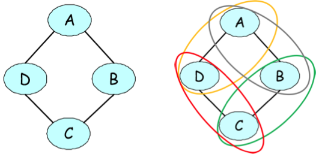

# 马尔可夫随机场

贝叶斯网络是一类能够紧凑地表示许多有趣概率分布的模型。
然而，我们在前一章中已经看到，一些分布可能具有独立性假设，无法用贝叶斯网络的结构完美地表示。

在这种情况下，除非我们想在模型的变量之间引入虚假的独立性，否则我们必须回到一种不太紧凑的表示法（可以看作是一个带有额外、不必要边的图）。
这会导致模型中出现额外的、不必要的参数，并使学习这些参数和进行预测变得更加困难。

然而，还有另一种基于*无向图*语言的紧凑表示和可视化概率分布的技术。
这类模型（称为马尔可夫随机场或MRF）可以简洁地表示有向模型无法表示的独立性假设。
在本章中，我们将探讨这些方法的优点和缺点。

## 马尔可夫随机场

举个能激发兴趣的例子，假设我们正在模拟 $A,B,C,D$ 4人的投票偏好，设$(A,B)$, $(B,C)$, $(C,D)$, $(D,A)$ 是朋友，
且朋友往往有相似的投票偏好。这些影响可以自然地用无向图表示。

<small>四人投票偏好联合概率的无向图表达。右图说明了模型中存在的成对因素。</small>

定义 $A,B,C,D$ 投票决策的联合概率的一种方法是将分数分配给这些变量的每一个赋值，然后将概率定义为标准化分数。
分数可以是任何函数，但在我们的例子中，我们将其定义为以下形式：

$$ \tilde p(A,B,C,D) = \phi(A,B)\phi(B,C)\phi(C,D)\phi(D,A) $$

其中 $\phi(X,Y)$ 是一个为朋友 $X,Y$ 之间的一致投票赋予更多权重的因子。例如：

$$
\begin{align*}
\phi(X,Y) =
\begin{cases}
10 & \text{if } X = Y = 1 \\
5  & \text{if } X = Y = 0 \\
1  & \text{otherwise}.
\end{cases}
\end{align*}
$$

非正态分布中的因子通常称为*因子*。最终概率定义为：

$$ p(A,B,C,D) = \frac{1}{Z} \tilde p(A,B,C,D) $$

其中 $ Z = \sum_{A,B,C,D} \tilde p(A,B,C,D) $ 是一个规范化常数，用于确保分布和为1。

### 正式定义

### 与贝叶斯网络的比较

### 马尔可夫随机场中的独立性

## 条件随机场

### 示例

### 正式定义

### 示例（续）

### CRF特性

## 因子图

